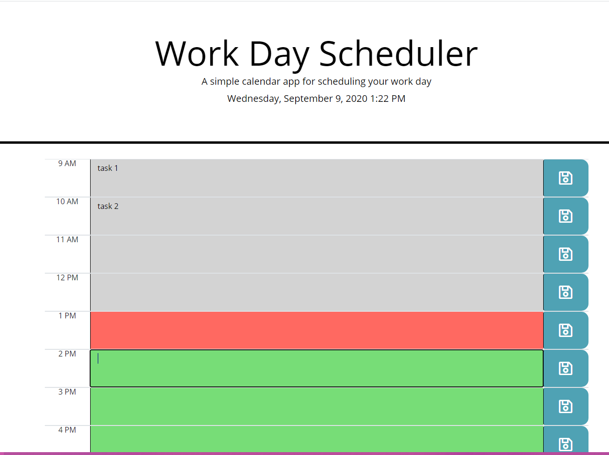
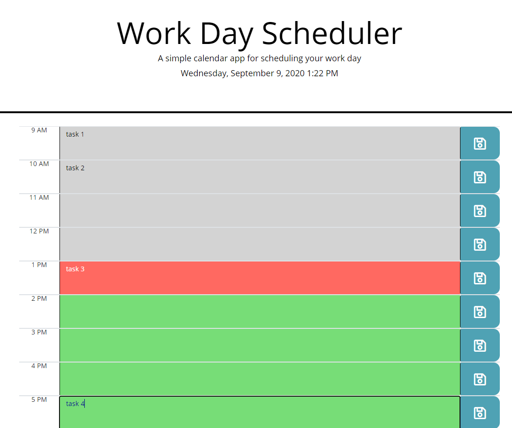

# 05 Third-Party APIs: Work Day Scheduler
This application is a simple calendar that allows the user to save tasks for each hour of the day. This app will run in the browser and feature dynamically updated HTML and CSS powered by jQuery.

### Application Functions

* The current day is displayed at the top of the calendar when the day scheduler is opened.

* The timeblock is based on the standard business hours from 9 am to 5 pm.
* Each timeblock is color coded to indicate whether it is in the past, present, or future.
* A user can enter an event into a timeblock and save by clicking the save button. The event will be saved in local storage.
